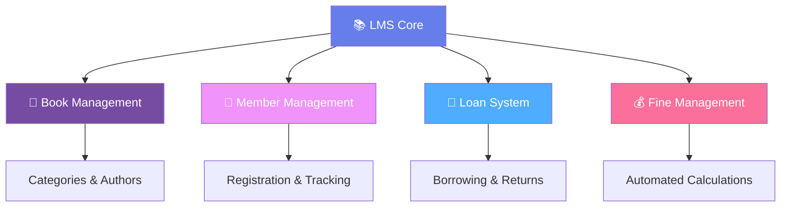
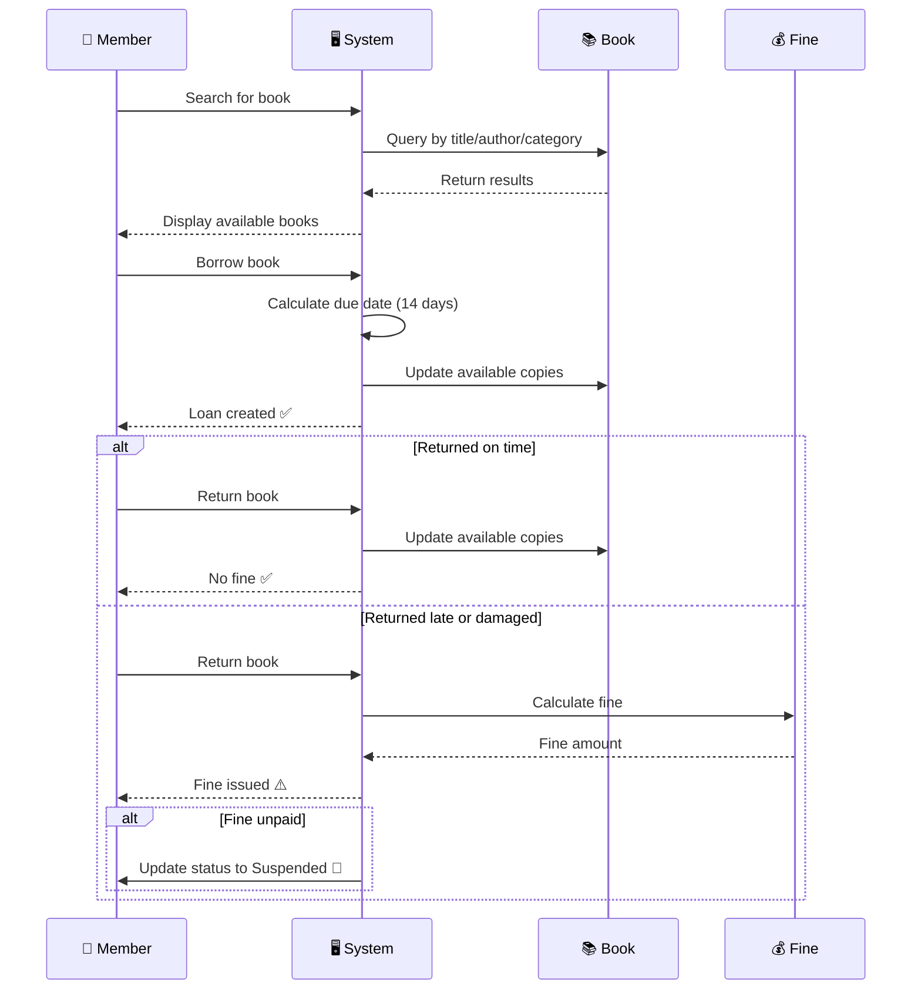
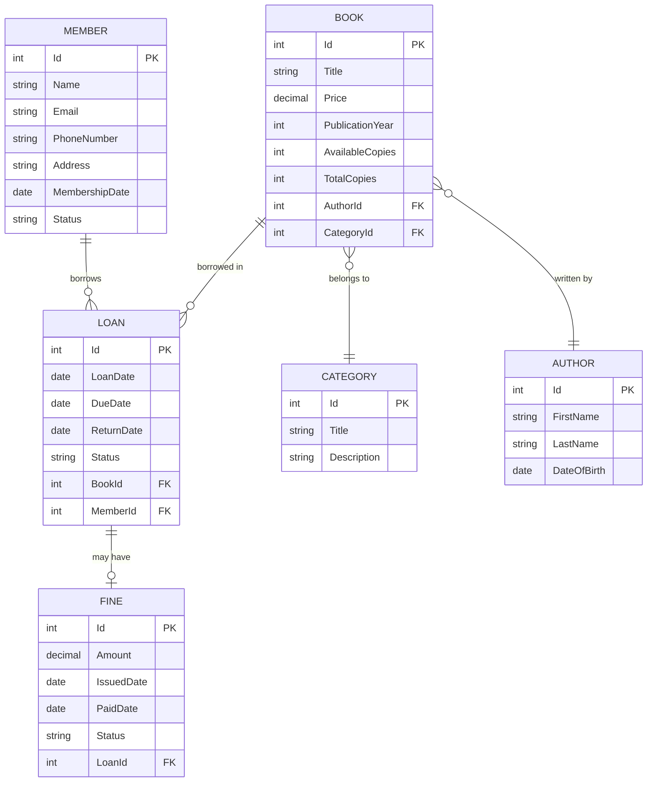

<div align="center">

# 📚 Library Management System (LMS)

### *Modern, Efficient, and Feature-Rich Library Management Solution*

[](https://dotnet.microsoft.com/)
[](https://docs.microsoft.com/en-us/ef/core/)
[](https://docs.microsoft.com/en-us/dotnet/csharp/)
[](https://www.microsoft.com/en-us/sql-server)


---

### 🎯 *Manage your library with ease and efficiency*

</div>

## 📑 Table of Contents

<details open>
<summary><b>Click to expand/collapse</b></summary>

- [🌟 Overview](#-overview)
- [✨ Key Features](#-key-features)
- [🎭 System Behavior](#-system-behavior)
- [🗂️ System Architecture](#️-system-architecture)
- [📊 Entities & Relationships](#-entities--relationships)
- [🔧 Model Configurations](#-model-configurations)
- [📐 Database Design](#-database-design)
- [🌱 Data Seeding](#-data-seeding)
- [💻 Data Manipulation Examples](#-data-manipulation-examples)
- [🛠️ Technologies Used](#️-technologies-used)
- [🚀 Getting Started](#-getting-started)
- [👨‍💻 Author](#-author)

</details>

---

## 🌟 Overview

The **Library Management System (LMS)** is a comprehensive solution designed to streamline the management of books, categories, authors, members, loans, and fines in a modern library environment.

<div align="center">



</div>

---

## ✨ Key Features

<table>
<tr>
<td width="50%">

### 📖 Book Organization
- ✅ Structured categorization system
- ✅ Author management and tracking
- ✅ Inventory control (available vs total copies)
- ✅ Publication year tracking
- ✅ Price management

</td>
<td width="50%">

### 👥 Member Management
- ✅ Easy member registration
- ✅ Status tracking (Active/Suspended)
- ✅ Complete contact information
- ✅ Membership history
- ✅ Automated status updates

</td>
</tr>
<tr>
<td width="50%">

### 🔄 Loan System
- ✅ Automated borrowing process
- ✅ Due date calculation
- ✅ Return tracking
- ✅ Overdue detection
- ✅ Status management

</td>
<td width="50%">

### 💰 Fine Management
- ✅ Automatic fine calculation
- ✅ Overdue and damage tracking
- ✅ Payment status monitoring
- ✅ Fine history maintenance
- ✅ Member suspension triggers

</td>
</tr>
</table>

---

## 🎭 System Behavior

<div align="center">



</div>

### 📋 Workflow Details

<table>
<tr>
<th>🔍 Search & Discovery</th>
<td>Members can search books by <strong>title</strong>, <strong>author</strong>, or <strong>category</strong></td>
</tr>
<tr>
<th>📅 Borrowing Process</th>
<td>When borrowing, a <strong>due date</strong> is automatically assigned (14 days from loan date)</td>
</tr>
<tr>
<th>✅ Timely Returns</th>
<td><strong>No fine</strong> is applied if the book is returned on or before the due date</td>
</tr>
<tr>
<th>⚠️ Late/Damaged Returns</th>
<td>A <strong>fine is calculated automatically</strong> upon return if overdue or damaged</td>
</tr>
<tr>
<th>🚫 Suspended Status</th>
<td>If fines remain <strong>unpaid</strong>, member status changes to <strong>Suspended</strong></td>
</tr>
</table>

---

## 🗂️ System Architecture

<div align="center">



</div>

---

## 📊 Entities & Relationships

### 📖 Book Entity

<table>
<tr>
<th width="30%">Property</th>
<th width="70%">Description</th>
</tr>
<tr>
<td><code>Id</code></td>
<td>🔑 Unique identifier (Primary Key)</td>
</tr>
<tr>
<td><code>Title</code></td>
<td>📝 Book title (Varchar 50)</td>
</tr>
<tr>
<td><code>Price</code></td>
<td>💵 Book price (Decimal 6,2)</td>
</tr>
<tr>
<td><code>PublicationYear</code></td>
<td>📅 Year of publication (1950 - Current Year)</td>
</tr>
<tr>
<td><code>AvailableCopies</code></td>
<td>📚 Number of available copies (≤ TotalCopies)</td>
</tr>
<tr>
<td><code>TotalCopies</code></td>
<td>📦 Total number of copies</td>
</tr>
</table>

**🔗 Relationships:**
- One Book → One Author (Many-to-One)
- One Book → One Category (Many-to-One)
- One Book → Many Loans (One-to-Many)

<details>
<summary><b>📝 Entity Class Implementation</b></summary>

```csharp
public class Book
{
    public int Id { get; set; }
    
    [Required]
    [MaxLength(50)]
    public string Title { get; set; }
    
    [Column(TypeName = "decimal(6,2)")]
    public decimal Price { get; set; }
    
    [Range(1950, 2100)]
    public int PublicationYear { get; set; }
    
    public int AvailableCopies { get; set; }
    public int TotalCopies { get; set; }
    
    // Foreign Keys
    public int AuthorId { get; set; }
    public int CategoryId { get; set; }
    
    // Navigation Properties
    public Author Author { get; set; }
    public Category Category { get; set; }
    public ICollection<Loan> Loans { get; set; }
}
```

</details>

---

### 📚 Category Entity

<table>
<tr>
<th width="30%">Property</th>
<th width="70%">Description</th>
</tr>
<tr>
<td><code>Id</code></td>
<td>🔑 Unique identifier (Primary Key)</td>
</tr>
<tr>
<td><code>Title</code></td>
<td>🏷️ Category name (Varchar 50)</td>
</tr>
<tr>
<td><code>Description</code></td>
<td>📄 Category details (Varchar 100)</td>
</tr>
</table>

**🔗 Relationships:**
- One Category → Many Books (One-to-Many)

<details>
<summary><b>📝 Entity Class Implementation</b></summary>

```csharp
public class Category
{
    public int Id { get; set; }
    
    [Required]
    [MaxLength(50)]
    public string Title { get; set; }
    
    [MaxLength(100)]
    public string Description { get; set; }
    
    // Navigation Properties
    public ICollection<Book> Books { get; set; }
}
```

</details>

---

### ✍️ Author Entity

<table>
<tr>
<th width="30%">Property</th>
<th width="70%">Description</th>
</tr>
<tr>
<td><code>Id</code></td>
<td>🔑 Unique identifier (Primary Key)</td>
</tr>
<tr>
<td><code>FirstName</code></td>
<td>👤 Author's first name (Varchar 20)</td>
</tr>
<tr>
<td><code>LastName</code></td>
<td>👤 Author's last name (Varchar 20)</td>
</tr>
<tr>
<td><code>DateOfBirth</code></td>
<td>🎂 Author's date of birth</td>
</tr>
</table>

**🔗 Relationships:**
- One Author → Many Books (One-to-Many)

<details>
<summary><b>📝 Entity Class Implementation</b></summary>

```csharp
public class Author
{
    public int Id { get; set; }
    
    [Required]
    [MaxLength(20)]
    public string FirstName { get; set; }
    
    [Required]
    [MaxLength(20)]
    public string LastName { get; set; }
    
    public DateTime DateOfBirth { get; set; }
    
    // Navigation Properties
    public ICollection<Book> Books { get; set; }
    
    // Computed Property
    [NotMapped]
    public string FullName => $"{FirstName} {LastName}";
}
```

</details>

---

### 👤 Member Entity

<table>
<tr>
<th width="30%">Property</th>
<th width="70%">Description</th>
</tr>
<tr>
<td><code>Id</code></td>
<td>🔑 Unique identifier (Primary Key)</td>
</tr>
<tr>
<td><code>Name</code></td>
<td>👤 Member name (Varchar 50)</td>
</tr>
<tr>
<td><code>Email</code></td>
<td>📧 Valid email address (Varchar 100)</td>
</tr>
<tr>
<td><code>PhoneNumber</code></td>
<td>📱 Egyptian phone format (Varchar 11)</td>
</tr>
<tr>
<td><code>Address</code></td>
<td>🏠 Member address (Varchar 100)</td>
</tr>
<tr>
<td><code>MembershipDate</code></td>
<td>📅 Registration date (Default: insertion date)</td>
</tr>
<tr>
<td><code>Status</code></td>
<td>🔄 Active or Suspended</td>
</tr>
</table>

**🔗 Relationships:**
- One Member → Many Loans (One-to-Many)

<details>
<summary><b>📝 Entity Class Implementation</b></summary>

```csharp
public class Member
{
    public int Id { get; set; }
    
    [Required]
    [MaxLength(50)]
    public string Name { get; set; }
    
    [Required]
    [MaxLength(100)]
    [EmailAddress]
    public string Email { get; set; }
    
    [Required]
    [MaxLength(11)]
    [RegularExpression(@"^01[0-2,5]{1}[0-9]{8}$")]
    public string PhoneNumber { get; set; }
    
    [MaxLength(100)]
    public string Address { get; set; }
    
    public DateTime MembershipDate { get; set; } = DateTime.Now;
    
    public MemberStatus Status { get; set; } = MemberStatus.Active;
    
    // Navigation Properties
    public ICollection<Loan> Loans { get; set; }
}

public enum MemberStatus
{
    Active,
    Suspended
}
```

</details>

---

### 🔄 Loan Entity

<table>
<tr>
<th width="30%">Property</th>
<th width="70%">Description</th>
</tr>
<tr>
<td><code>Id</code></td>
<td>🔑 Unique identifier (Primary Key)</td>
</tr>
<tr>
<td><code>LoanDate</code></td>
<td>📅 Borrowing date (Default: insertion date)</td>
</tr>
<tr>
<td><code>DueDate</code></td>
<td>⏰ Expected return date (LoanDate + 14 days)</td>
</tr>
<tr>
<td><code>ReturnDate</code></td>
<td>✅ Actual return date (nullable)</td>
</tr>
<tr>
<td><code>Status</code></td>
<td>🔄 Borrowed, Returned, or Overdue</td>
</tr>
</table>

**🔗 Relationships:**
- One Loan → One Book (Many-to-One)
- One Loan → One Member (Many-to-One)
- One Loan → One Fine (One-to-One, optional)

<details>
<summary><b>📝 Entity Class Implementation</b></summary>

```csharp
public class Loan
{
    public int Id { get; set; }
    
    public DateTime LoanDate { get; set; } = DateTime.Now;
    
    public DateTime DueDate { get; set; }
    
    public DateTime? ReturnDate { get; set; }
    
    public LoanStatus Status { get; set; } = LoanStatus.Borrowed;
    
    // Foreign Keys
    public int BookId { get; set; }
    public int MemberId { get; set; }
    
    // Navigation Properties
    public Book Book { get; set; }
    public Member Member { get; set; }
    public Fine Fine { get; set; }
    
    // Computed Property
    [NotMapped]
    public bool IsOverdue => 
        Status == LoanStatus.Borrowed && DateTime.Now > DueDate;
}

public enum LoanStatus
{
    Borrowed,
    Returned,
    Overdue
}
```

</details>

---

### 💰 Fine Entity

<table>
<tr>
<th width="30%">Property</th>
<th width="70%">Description</th>
</tr>
<tr>
<td><code>Id</code></td>
<td>🔑 Unique identifier (Primary Key)</td>
</tr>
<tr>
<td><code>Amount</code></td>
<td>💵 Fine amount (Decimal 6,2)</td>
</tr>
<tr>
<td><code>IssuedDate</code></td>
<td>📅 Fine issue date (Default: insertion date)</td>
</tr>
<tr>
<td><code>PaidDate</code></td>
<td>✅ Payment date (nullable)</td>
</tr>
<tr>
<td><code>Status</code></td>
<td>🔄 Pending or Paid</td>
</tr>
</table>

**🔗 Relationships:**
- One Fine → One Loan (One-to-One)

<details>
<summary><b>📝 Entity Class Implementation</b></summary>

```csharp
public class Fine
{
    public int Id { get; set; }
    
    [Column(TypeName = "decimal(6,2)")]
    public decimal Amount { get; set; }
    
    public DateTime IssuedDate { get; set; } = DateTime.Now;
    
    public DateTime? PaidDate { get; set; }
    
    public FineStatus Status { get; set; } = FineStatus.Pending;
    
    // Foreign Key
    public int LoanId { get; set; }
    
    // Navigation Property
    public Loan Loan { get; set; }
}

public enum FineStatus
{
    Pending,
    Paid
}
```

</details>

---

## 🔧 Model Configurations

### Fluent API Configuration

<details>
<summary><b>📝 Complete DbContext Configuration</b></summary>

```csharp
public class LibraryDbContext : DbContext
{
    public DbSet<Book> Books { get; set; }
    public DbSet<Category> Categories { get; set; }
    public DbSet<Author> Authors { get; set; }
    public DbSet<Member> Members { get; set; }
    public DbSet<Loan> Loans { get; set; }
    public DbSet<Fine> Fines { get; set; }

    protected override void OnModelCreating(ModelBuilder modelBuilder)
    {
        // Book Configuration
        modelBuilder.Entity<Book>(entity =>
        {
            entity.Property(b => b.Title)
                .IsRequired()
                .HasMaxLength(50);

            entity.Property(b => b.Price)
                .HasColumnType("decimal(6,2)");

            entity.Property(b => b.PublicationYear)
                .HasAnnotation("Range", new[] { 1950, DateTime.Now.Year });

            // Ensure AvailableCopies <= TotalCopies
            entity.HasCheckConstraint(
                "CK_Book_AvailableCopies", 
                "AvailableCopies <= TotalCopies"
            );

            // Relationships
            entity.HasOne(b => b.Author)
                .WithMany(a => a.Books)
                .HasForeignKey(b => b.AuthorId)
                .OnDelete(DeleteBehavior.Restrict);

            entity.HasOne(b => b.Category)
                .WithMany(c => c.Books)
                .HasForeignKey(b => b.CategoryId)
                .OnDelete(DeleteBehavior.Restrict);
        });

        // Category Configuration
        modelBuilder.Entity<Category>(entity =>
        {
            entity.Property(c => c.Title)
                .IsRequired()
                .HasMaxLength(50);

            entity.Property(c => c.Description)
                .HasMaxLength(100);
        });

        // Author Configuration
        modelBuilder.Entity<Author>(entity =>
        {
            entity.Property(a => a.FirstName)
                .IsRequired()
                .HasMaxLength(20);

            entity.Property(a => a.LastName)
                .IsRequired()
                .HasMaxLength(20);
        });

        // Member Configuration
        modelBuilder.Entity<Member>(entity =>
        {
            entity.Property(m => m.Name)
                .IsRequired()
                .HasMaxLength(50);

            entity.Property(m => m.Email)
                .IsRequired()
                .HasMaxLength(100);

            entity.HasIndex(m => m.Email)
                .IsUnique();

            entity.Property(m => m.PhoneNumber)
                .IsRequired()
                .HasMaxLength(11);

            entity.Property(m => m.Address)
                .HasMaxLength(100);

            entity.Property(m => m.MembershipDate)
                .HasDefaultValueSql("GETDATE()");

            entity.Property(m => m.Status)
                .HasConversion<string>();
        });

        // Loan Configuration
        modelBuilder.Entity<Loan>(entity =>
        {
            entity.Property(l => l.LoanDate)
                .HasDefaultValueSql("GETDATE()");

            entity.Property(l => l.Status)
                .HasConversion<string>();

            entity.HasOne(l => l.Book)
                .WithMany(b => b.Loans)
                .HasForeignKey(l => l.BookId)
                .OnDelete(DeleteBehavior.Restrict);

            entity.HasOne(l => l.Member)
                .WithMany(m => m.Loans)
                .HasForeignKey(l => l.MemberId)
                .OnDelete(DeleteBehavior.Restrict);
        });

        // Fine Configuration
        modelBuilder.Entity<Fine>(entity =>
        {
            entity.Property(f => f.Amount)
                .HasColumnType("decimal(6,2)");

            entity.Property(f => f.IssuedDate)
                .HasDefaultValueSql("GETDATE()");

            entity.Property(f => f.Status)
                .HasConversion<string>();

            entity.HasOne(f => f.Loan)
                .WithOne(l => l.Fine)
                .HasForeignKey<Fine>(f => f.LoanId)
                .OnDelete(DeleteBehavior.Restrict);
        });
    }
}
```

</details>

---

## 📐 Database Design

### 🎨 Visual Representation

<div align="center">

**Entity Relationship Diagram (ERD)**

*Shows the complete database structure with all relationships and constraints*

</div>

### 📋 Table Structure Summary

| Table | Primary Key | Foreign Keys | Special Constraints |
|-------|-------------|--------------|---------------------|
| **Books** | Id | AuthorId, CategoryId | AvailableCopies ≤ TotalCopies |
| **Categories** | Id | - | - |
| **Authors** | Id | - | - |
| **Members** | Id | - | Unique Email |
| **Loans** | Id | BookId, MemberId | - |
| **Fines** | Id | LoanId | - |

---

## 🌱 Data Seeding

Pre-populated sample data for testing and demonstration:

<div align="center">

### 📦 Download Seed Data

| Entity | Records | Download Link |
|--------|---------|---------------|
| 📚 **Authors** | 50+ | [📥 Download](https://drive.google.com/file/d/1btBhQKUntkndL-tMpc4br_FwpbGaKOpZ/view) |
| 🏷️ **Categories** | 20+ | [📥 Download](https://drive.google.com/file/d/1Rykot40B5avu5ocXvx_XKR0UPypSiURS/view) |
| 📖 **Books** | 200+ | [📥 Download](https://drive.google.com/file/d/1PB2nGkN-0gi1rHgE5M5iK7rcQU0HsfHN/view) |
| 👥 **Members** | 100+ | [📥 Download](https://drive.google.com/file/d/1kLFK8EC9DY1-74h1qHRyvPKhZTcYKwAK/view) |

</div>

<details>
<summary><b>📝 Seed Data Implementation</b></summary>

```csharp
protected override void OnModelCreating(ModelBuilder modelBuilder)
{
    // Seed Categories
    modelBuilder.Entity<Category>().HasData(
        new Category { Id = 1, Title = "Fiction", Description = "Fictional novels and stories" },
        new Category { Id = 2, Title = "Science", Description = "Scientific books and research" },
        new Category { Id = 3, Title = "History", Description = "Historical documents and books" }
    );

    // Seed Authors
    modelBuilder.Entity<Author>().HasData(
        new Author { Id = 1, FirstName = "George", LastName = "Orwell", DateOfBirth = new DateTime(1903, 6, 25) },
        new Author { Id = 2, FirstName = "Jane", LastName = "Austen", DateOfBirth = new DateTime(1775, 12, 16) }
    );

    // Seed Books
    modelBuilder.Entity<Book>().HasData(
        new Book 
        { 
            Id = 1, 
            Title = "1984", 
            Price = 299.99m, 
            PublicationYear = 1949, 
            TotalCopies = 5, 
            AvailableCopies = 5,
            AuthorId = 1,
            CategoryId = 1
        }
    );
}
```

</details>

---

## 💻 Data Manipulation Examples

### 📊 Common Query Scenarios

#### 1️⃣ Retrieve Books with Price > 300

```csharp
var expensiveBooks = context.Books
    .Include(b => b.Category)
    .Include(b => b.Author)
    .Where(b => b.Price > 300)
    .Select(b => new
    {
        BookTitle = b.Title,
        CategoryTitle = b.Category.Title,
        AuthorFullName = $"{b.Author.FirstName} {b.Author.LastName}",
        Price = b.Price
    })
    .ToList();

// Display results
foreach (var book in expensiveBooks)
{
    Console.WriteLine($"{book.BookTitle} by {book.AuthorFullName} " +
                     $"({book.CategoryTitle}) - ${book.Price}");
}
```

**📋 Output:**
```
Advanced Calculus by John Smith (Science) - $349.99
War and Peace by Leo Tolstoy (Fiction) - $425.50
...
```

---

#### 2️⃣ Retrieve All Authors and Their Books

```csharp
var authorsWithBooks = context.Authors
    .Include(a => a.Books)
    .Select(a => new
    {
        Author = $"{a.FirstName} {a.LastName}",
        BookCount = a.Books.Count,
        Books = a.Books.Select(b => b.Title).ToList()
    })
    .ToList();

// Display results
foreach (var author in authorsWithBooks)
{
    Console.WriteLine($"\n{author.Author} ({author.BookCount} books):");
    foreach (var book in author.Books)
    {
        Console.WriteLine($"  - {book}");
    }
}
```

**📋 Output:**
```
George Orwell (2 books):
  - 1984
  - Animal Farm

Jane Austen (3 books):
  - Pride and Prejudice
  - Sense and Sensibility
  - Emma
```

---

#### 3️⃣ Member Borrows and Returns Book (5 Days)

```csharp
// Member with ID = 1 borrows Book with ID = 2
var member = context.Members.Find(1);
var book = context.Books.Find(2);

// Create loan
var loan = new Loan
{
    BookId = book.Id,
    MemberId = member.Id,
    LoanDate = DateTime.Now,
    DueDate = DateTime.Now.AddDays(14),
    Status = LoanStatus.Borrowed
};

// Update available copies
book.AvailableCopies--;

context.Loans.Add(loan);
context.SaveChanges();

Console.WriteLine($"✅ Loan created: {member.Name} borrowed '{book.Title}'");
Console.WriteLine($"📅 Due Date: {loan.DueDate:yyyy-MM-dd}");

// Return after 5 days (on time)
loan.ReturnDate = DateTime.Now.AddDays(5);
loan.Status = LoanStatus.Returned;
book.AvailableCopies++;

context.SaveChanges();

Console.WriteLine($"✅ Book returned on time. No fine.");
```

**📋 Output:**
```
✅ Loan created: Ahmed Hassan borrowed 'Clean Code'
📅 Due Date: 2024-02-15
✅ Book returned on time. No fine.
```

---

#### 4️⃣ Member Returns Book Late (10 Days Overdue)

```csharp
// Return after 10 days (overdue)
loan.ReturnDate = loan.DueDate.AddDays(10);
loan.Status = LoanStatus.Returned;
book.AvailableCopies++;

// Calculate overdue days
int overdueDays = (loan.ReturnDate.Value - loan.DueDate).Days;

// Create fine (e.g., $5 per day)
decimal fineAmount = overdueDays * 5;

var fine = new Fine
{
    LoanId = loan.Id,
    Amount = fineAmount,
    IssuedDate = DateTime.Now,
    Status = FineStatus.Pending
};

context.Fines.Add(fine);
context.SaveChanges();

Console.WriteLine($"⚠️ Book returned {overdueDays} days late.");
Console.WriteLine($"💰 Fine issued: ${fineAmount}");
```

**📋 Output:**
```
⚠️ Book returned 10 days late.
💰 Fine issued: $50.00
```

---

#### 5️⃣ Retrieve Members with Active Loans

```csharp
var membersWithActiveLoans = context.Members
    .Include(m => m.Loans)
        .ThenInclude(l => l.Book)
    .Where(m => m.Loans.Any(l => l.Status == LoanStatus.Borrowed))
    .Select(m => new
    {
        MemberName = m.Name,
        Email = m.Email,
        ActiveLoans = m.Loans
            .Where(l => l.Status == LoanStatus.Borrowed)
            .Select(l => new
            {
                BookTitle = l.Book.Title,
                LoanDate = l.LoanDate,
                DueDate = l.DueDate,
                IsOverdue = l.IsOverdue
            })
            .ToList()
    })
    .ToList();

// Display results
foreach (var member in membersWithActiveLoans)
{
    Console.WriteLine($"\n👤 {member.MemberName} ({member.Email})");
    foreach (var loan in member.ActiveLoans)
    {
        string status = loan.IsOverdue ? "🔴 OVERDUE" : "🟢 On Time";
        Console.WriteLine($"  📖 {loan.BookTitle}");
        Console.WriteLine($"     Loaned: {loan.LoanDate:yyyy-MM-dd}");
        Console.WriteLine($"     Due: {loan.DueDate:yyyy-MM-dd} {status}");
    }
}
```

**📋 Output:**
```
👤 Ahmed Hassan (ahmed.hassan@email.com)
  📖 Clean Code
     Loaned: 2024-02-01
     Due: 2024-02-15 🟢 On Time

👤 Sara Ali (sara.ali@email.com)
  📖 Design Patterns
     Loaned: 2024-01-20
     Due: 2024-02-03 🔴 OVERDUE
```

---

## 🛠️ Technologies Used

<div align="center">

| Technology | Version | Purpose |
|------------|---------|---------|
|  | 10.0+ | Programming Language |
|  | 6.0+ | Framework |
|  | 6.0+ | ORM |
|  | 2019+ | Database |

</div>

---

## 🚀 Getting Started

### Prerequisites

```bash
# .NET SDK 6.0 or later
dotnet --version

# SQL Server (LocalDB, Express, or Full)
# Visual Studio 2022 or VS Code
```

### Installation

```bash
# 1. Clone the repository
git clone https://github.com/username/library-management-system.git
cd library-management-system

# 2. Restore dependencies
dotnet restore

# 3. Update connection string in appsettings.json
{
  "ConnectionStrings": {
    "DefaultConnection": "Server=.;Database=LibraryDB;Trusted_Connection=True;"
  }
}

# 4. Run migrations
dotnet ef database update

# 5. Run the application
dotnet run
```

### Quick Start

```csharp
// Create DbContext
using var context = new LibraryDbContext();

// Query books
var books = context.Books
    .Include(b => b.Author)
    .Include(b => b.Category)
    .ToList();

// Create a new loan
var loan = new Loan
{
    BookId = 1,
    MemberId = 1,
    LoanDate = DateTime.Now,
    DueDate = DateTime.Now.AddDays(14),
    Status = LoanStatus.Borrowed
};

context.Loans.Add(loan);
context.SaveChanges();
```

---

## 📸 Screenshots

<div align="center">

*Coming Soon: Screenshots of the application in action*

</div>

---

## 🤝 Contributing

Contributions, issues, and feature requests are welcome!

1. Fork the Project
2. Create your Feature Branch (`git checkout -b feature/AmazingFeature`)
3. Commit your Changes (`git commit -m 'Add some AmazingFeature'`)
4. Push to the Branch (`git push origin feature/AmazingFeature`)
5. Open a Pull Request

---

## 📄 License

This project is licensed under the MIT License - see the [LICENSE](LICENSE) file for details.

---

## 👨‍💻 Author

<div align="center">

**Abdullah**

[](https://github.com/username)
[](https://linkedin.com/in/username)
[](mailto:email@example.com)

</div>

---

## 🙏 Acknowledgments

- Entity Framework Core Documentation
- .NET Community
- SQL Server Best Practices

---

<div align="center">

### ⭐ If you find this project helpful, please give it a star!

**Made with ❤️ by Abdullah**

</div>
