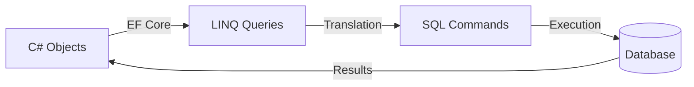
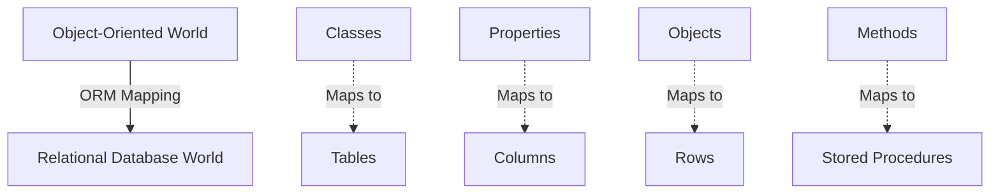
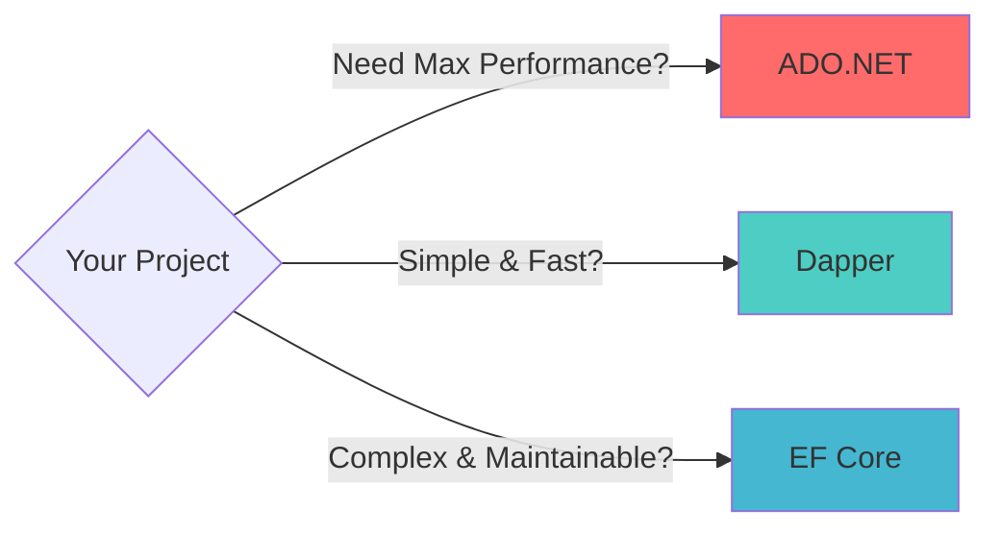
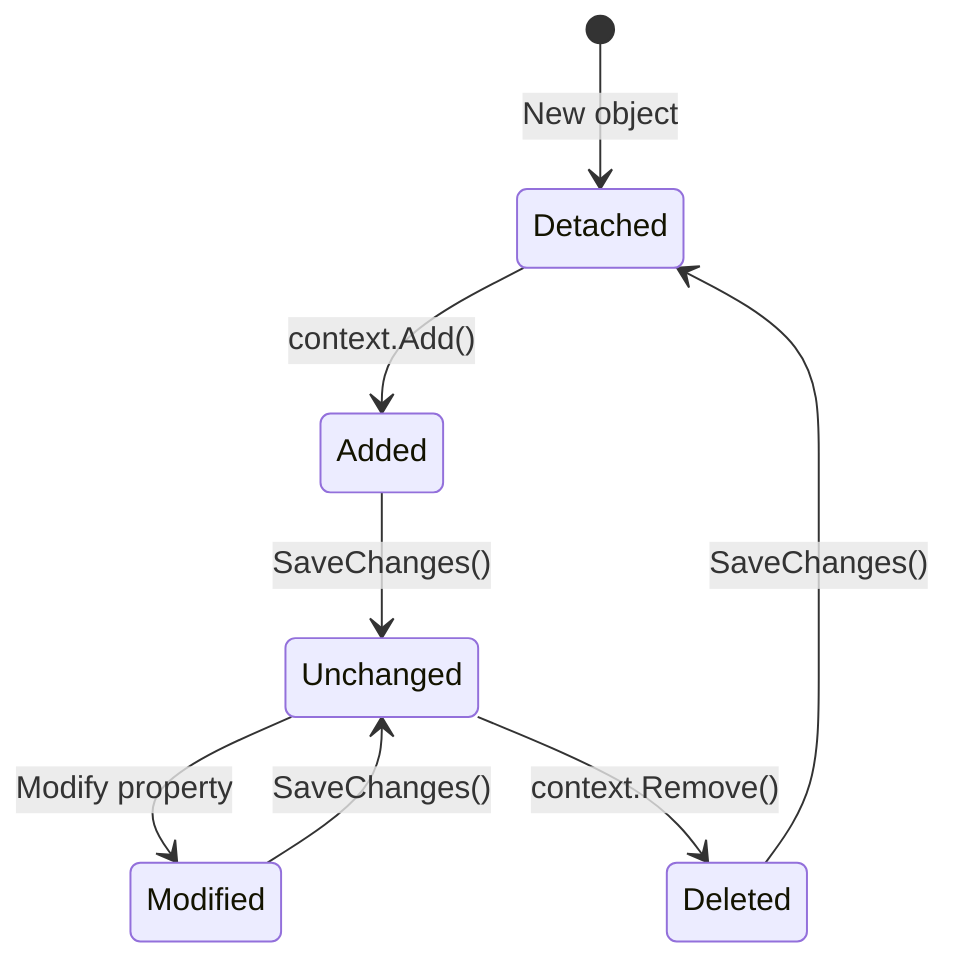
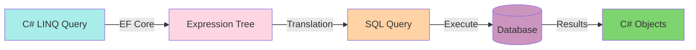

<div align="center">

# 📚 Library Management System (LMS)

### *Modern, Efficient, and Feature-Rich Library Management Solution*

[](https://dotnet.microsoft.com/)
[](https://docs.microsoft.com/en-us/ef/core/)
[](https://docs.microsoft.com/en-us/dotnet/csharp/)
[](https://www.microsoft.com/en-us/sql-server)


---

### 🎯 *Manage your library with ease and efficiency*

</div>

## 📑 Table of Contents

<details open>
<summary><b>Click to expand/collapse</b></summary>

- [🌟 Overview](#-overview)
- [✨ Key Features](#-key-features)
- [🎭 System Behavior](#-system-behavior)
- [🗂️ System Architecture](#️-system-architecture)
- [📊 Entities & Relationships](#-entities--relationships)
- [🔧 Model Configurations](#-model-configurations)
- [📐 Database Design](#-database-design)
- [🌱 Data Seeding](#-data-seeding)
- [💻 Data Manipulation Examples](#-data-manipulation-examples)
- [🛠️ Technologies Used](#️-technologies-used)
- [🚀 Getting Started](#-getting-started)
- [👨‍💻 Author](#-author)

</details>

---

## 🌟 Overview

The **Library Management System (LMS)** is a comprehensive solution designed to streamline the management of books, categories, authors, members, loans, and fines in a modern library environment.

```mermaid
graph TB
    A[📚 LMS Core] --> B[📖 Book Management]
    A --> C[👥 Member Management]
    A --> D[🔄 Loan System]
    A --> E[💰 Fine Management]
    
    B --> F[Categories & Authors]
    C --> G[Registration & Tracking]
    D --> H[Borrowing & Returns]
    E --> I[Automated Calculations]
    
    style A fill:#667eea,color:#fff
    style B fill:#764ba2,color:#fff
    style C fill:#f093fb,color:#fff
    style D fill:#4facfe,color:#fff
    style E fill:#fa709a,color:#fff
```

<div align="center">



</div>

---

## ✨ Key Features

<table>
<tr>
<td width="50%">

### 📖 Book Organization
- ✅ Structured categorization system
- ✅ Author management and tracking
- ✅ Inventory control (available vs total copies)
- ✅ Publication year tracking
- ✅ Price management

</td>
<td width="50%">

### 👥 Member Management
- ✅ Easy member registration
- ✅ Status tracking (Active/Suspended)
- ✅ Complete contact information
- ✅ Membership history
- ✅ Automated status updates

</td>
</tr>
<tr>
<td width="50%">

### 🔄 Loan System
- ✅ Automated borrowing process
- ✅ Due date calculation
- ✅ Return tracking
- ✅ Overdue detection
- ✅ Status management

</td>
<td width="50%">

### 💰 Fine Management
- ✅ Automatic fine calculation
- ✅ Overdue and damage tracking
- ✅ Payment status monitoring
- ✅ Fine history maintenance
- ✅ Member suspension triggers

</td>
</tr>
</table>

---

## 🎭 System Behavior

```mermaid
sequenceDiagram
    participant M as 👤 Member
    participant S as 🖥️ System
    participant B as 📚 Book
    participant F as 💰 Fine
    
    M->>S: Search for book
    S->>B: Query by title/author/category
    B-->>S: Return results
    S-->>M: Display available books
    
    M->>S: Borrow book
    S->>S: Calculate due date (14 days)
    S->>B: Update available copies
    S-->>M: Loan created ✅
    
    alt Returned on time
        M->>S: Return book
        S->>B: Update available copies
        S-->>M: No fine ✅
    else Returned late or damaged
        M->>S: Return book
        S->>F: Calculate fine
        F-->>S: Fine amount
        S-->>M: Fine issued ⚠️
        
        alt Fine unpaid
            S->>M: Update status to Suspended 🚫
        end
    end
```

<div align="center">



</div>

### 📋 Workflow Details

<table>
<tr>
<th>🔍 Search & Discovery</th>
<td>Members can search books by <strong>title</strong>, <strong>author</strong>, or <strong>category</strong></td>
</tr>
<tr>
<th>📅 Borrowing Process</th>
<td>When borrowing, a <strong>due date</strong> is automatically assigned (14 days from loan date)</td>
</tr>
<tr>
<th>✅ Timely Returns</th>
<td><strong>No fine</strong> is applied if the book is returned on or before the due date</td>
</tr>
<tr>
<th>⚠️ Late/Damaged Returns</th>
<td>A <strong>fine is calculated automatically</strong> upon return if overdue or damaged</td>
</tr>
<tr>
<th>🚫 Suspended Status</th>
<td>If fines remain <strong>unpaid</strong>, member status changes to <strong>Suspended</strong></td>
</tr>
</table>

---

## 🗂️ System Architecture

<div align="center">


</div>

---

## 📊 Entities & Relationships

### 📖 Book Entity

<table>
<tr>
<th width="30%">Property</th>
<th width="70%">Description</th>
</tr>
<tr>
<td><code>Id</code></td>
<td>🔑 Unique identifier (Primary Key)</td>
</tr>
<tr>
<td><code>Title</code></td>
<td>📝 Book title (Varchar 50)</td>
</tr>
<tr>
<td><code>Price</code></td>
<td>💵 Book price (Decimal 6,2)</td>
</tr>
<tr>
<td><code>PublicationYear</code></td>
<td>📅 Year of publication (1950 - Current Year)</td>
</tr>
<tr>
<td><code>AvailableCopies</code></td>
<td>📚 Number of available copies (≤ TotalCopies)</td>
</tr>
<tr>
<td><code>TotalCopies</code></td>
<td>📦 Total number of copies</td>
</tr>
</table>

**🔗 Relationships:**
- One Book → One Author (Many-to-One)
- One Book → One Category (Many-to-One)
- One Book → Many Loans (One-to-Many)

<details>
<summary><b>📝 Entity Class Implementation</b></summary>

```csharp
public class Book
{
    public int Id { get; set; }
    
    [Required]
    [MaxLength(50)]
    public string Title { get; set; }
    
    [Column(TypeName = "decimal(6,2)")]
    public decimal Price { get; set; }
    
    [Range(1950, 2100)]
    public int PublicationYear { get; set; }
    
    public int AvailableCopies { get; set; }
    public int TotalCopies { get; set; }
    
    // Foreign Keys
    public int AuthorId { get; set; }
    public int CategoryId { get; set; }
    
    // Navigation Properties
    public Author Author { get; set; }
    public Category Category { get; set; }
    public ICollection<Loan> Loans { get; set; }
}
```

</details>

---

### 📚 Category Entity

<table>
<tr>
<th width="30%">Property</th>
<th width="70%">Description</th>
</tr>
<tr>
<td><code>Id</code></td>
<td>🔑 Unique identifier (Primary Key)</td>
</tr>
<tr>
<td><code>Title</code></td>
<td>🏷️ Category name (Varchar 50)</td>
</tr>
<tr>
<td><code>Description</code></td>
<td>📄 Category details (Varchar 100)</td>
</tr>
</table>

**🔗 Relationships:**
- One Category → Many Books (One-to-Many)

<details>
<summary><b>📝 Entity Class Implementation</b></summary>

```csharp
public class Category
{
    public int Id { get; set; }
    
    [Required]
    [MaxLength(50)]
    public string Title { get; set; }
    
    [MaxLength(100)]
    public string Description { get; set; }
    
    // Navigation Properties
    public ICollection<Book> Books { get; set; }
}
```

</details>

---

### ✍️ Author Entity

<table>
<tr>
<th width="30%">Property</th>
<th width="70%">Description</th>
</tr>
<tr>
<td><code>Id</code></td>
<td>🔑 Unique identifier (Primary Key)</td>
</tr>
<tr>
<td><code>FirstName</code></td>
<td>👤 Author's first name (Varchar 20)</td>
</tr>
<tr>
<td><code>LastName</code></td>
<td>👤 Author's last name (Varchar 20)</td>
</tr>
<tr>
<td><code>DateOfBirth</code></td>
<td>🎂 Author's date of birth</td>
</tr>
</table>

**🔗 Relationships:**
- One Author → Many Books (One-to-Many)

<details>
<summary><b>📝 Entity Class Implementation</b></summary>

```csharp
public class Author
{
    public int Id { get; set; }
    
    [Required]
    [MaxLength(20)]
    public string FirstName { get; set; }
    
    [Required]
    [MaxLength(20)]
    public string LastName { get; set; }
    
    public DateTime DateOfBirth { get; set; }
    
    // Navigation Properties
    public ICollection<Book> Books { get; set; }
    
    // Computed Property
    [NotMapped]
    public string FullName => $"{FirstName} {LastName}";
}
```

</details>

---

### 👤 Member Entity

<table>
<tr>
<th width="30%">Property</th>
<th width="70%">Description</th>
</tr>
<tr>
<td><code>Id</code></td>
<td>🔑 Unique identifier (Primary Key)</td>
</tr>
<tr>
<td><code>Name</code></td>
<td>👤 Member name (Varchar 50)</td>
</tr>
<tr>
<td><code>Email</code></td>
<td>📧 Valid email address (Varchar 100)</td>
</tr>
<tr>
<td><code>PhoneNumber</code></td>
<td>📱 Egyptian phone format (Varchar 11)</td>
</tr>
<tr>
<td><code>Address</code></td>
<td>🏠 Member address (Varchar 100)</td>
</tr>
<tr>
<td><code>MembershipDate</code></td>
<td>📅 Registration date (Default: insertion date)</td>
</tr>
<tr>
<td><code>Status</code></td>
<td>🔄 Active or Suspended</td>
</tr>
</table>

**🔗 Relationships:**
- One Member → Many Loans (One-to-Many)

<details>
<summary><b>📝 Entity Class Implementation</b></summary>

```csharp
public class Member
{
    public int Id { get; set; }
    
    [Required]
    [MaxLength(50)]
    public string Name { get; set; }
    
    [Required]
    [MaxLength(100)]
    [EmailAddress]
    public string Email { get; set; }
    
    [Required]
    [MaxLength(11)]
    [RegularExpression(@"^01[0-2,5]{1}[0-9]{8}$")]
    public string PhoneNumber { get; set; }
    
    [MaxLength(100)]
    public string Address { get; set; }
    
    public DateTime MembershipDate { get; set; } = DateTime.Now;
    
    public MemberStatus Status { get; set; } = MemberStatus.Active;
    
    // Navigation Properties
    public ICollection<Loan> Loans { get; set; }
}

public enum MemberStatus
{
    Active,
    Suspended
}
```

</details>

---

### 🔄 Loan Entity

<table>
<tr>
<th width="30%">Property</th>
<th width="70%">Description</th>
</tr>
<tr>
<td><code>Id</code></td>
<td>🔑 Unique identifier (Primary Key)</td>
</tr>
<tr>
<td><code>LoanDate</code></td>
<td>📅 Borrowing date (Default: insertion date)</td>
</tr>
<tr>
<td><code>DueDate</code></td>
<td>⏰ Expected return date (LoanDate + 14 days)</td>
</tr>
<tr>
<td><code>ReturnDate</code></td>
<td>✅ Actual return date (nullable)</td>
</tr>
<tr>
<td><code>Status</code></td>
<td>🔄 Borrowed, Returned, or Overdue</td>
</tr>
</table>

**🔗 Relationships:**
- One Loan → One Book (Many-to-One)
- One Loan → One Member (Many-to-One)
- One Loan → One Fine (One-to-One, optional)

<details>
<summary><b>📝 Entity Class Implementation</b></summary>

```csharp
public class Loan
{
    public int Id { get; set; }
    
    public DateTime LoanDate { get; set; } = DateTime.Now;
    
    public DateTime DueDate { get; set; }
    
    public DateTime? ReturnDate { get; set; }
    
    public LoanStatus Status { get; set; } = LoanStatus.Borrowed;
    
    // Foreign Keys
    public int BookId { get; set; }
    public int MemberId { get; set; }
    
    // Navigation Properties
    public Book Book { get; set; }
    public Member Member { get; set; }
    public Fine Fine { get; set; }
    
    // Computed Property
    [NotMapped]
    public bool IsOverdue => 
        Status == LoanStatus.Borrowed && DateTime.Now > DueDate;
}

public enum LoanStatus
{
    Borrowed,
    Returned,
    Overdue
}
```

</details>

---

### 💰 Fine Entity

<table>
<tr>
<th width="30%">Property</th>
<th width="70%">Description</th>
</tr>
<tr>
<td><code>Id</code></td>
<td>🔑 Unique identifier (Primary Key)</td>
</tr>
<tr>
<td><code>Amount</code></td>
<td>💵 Fine amount (Decimal 6,2)</td>
</tr>
<tr>
<td><code>IssuedDate</code></td>
<td>📅 Fine issue date (Default: insertion date)</td>
</tr>
<tr>
<td><code>PaidDate</code></td>
<td>✅ Payment date (nullable)</td>
</tr>
<tr>
<td><code>Status</code></td>
<td>🔄 Pending or Paid</td>
</tr>
</table>

**🔗 Relationships:**
- One Fine → One Loan (One-to-One)

<details>
<summary><b>📝 Entity Class Implementation</b></summary>

```csharp
public class Fine
{
    public int Id { get; set; }
    
    [Column(TypeName = "decimal(6,2)")]
    public decimal Amount { get; set; }
    
    public DateTime IssuedDate { get; set; } = DateTime.Now;
    
    public DateTime? PaidDate { get; set; }
    
    public FineStatus Status { get; set; } = FineStatus.Pending;
    
    // Foreign Key
    public int LoanId { get; set; }
    
    // Navigation Property
    public Loan Loan { get; set; }
}

public enum FineStatus
{
    Pending,
    Paid
}
```

</details>

---

## 🔧 Model Configurations

### Fluent API Configuration

<details>
<summary><b>📝 Complete DbContext Configuration</b></summary>

```csharp
public class LibraryDbContext : DbContext
{
    public DbSet<Book> Books { get; set; }
    public DbSet<Category> Categories { get; set; }
    public DbSet<Author> Authors { get; set; }
    public DbSet<Member> Members { get; set; }
    public DbSet<Loan> Loans { get; set; }
    public DbSet<Fine> Fines { get; set; }

    protected override void OnModelCreating(ModelBuilder modelBuilder)
    {
        // Book Configuration
        modelBuilder.Entity<Book>(entity =>
        {
            entity.Property(b => b.Title)
                .IsRequired()
                .HasMaxLength(50);

            entity.Property(b => b.Price)
                .HasColumnType("decimal(6,2)");

            entity.Property(b => b.PublicationYear)
                .HasAnnotation("Range", new[] { 1950, DateTime.Now.Year });

            // Ensure AvailableCopies <= TotalCopies
            entity.HasCheckConstraint(
                "CK_Book_AvailableCopies", 
                "AvailableCopies <= TotalCopies"
            );

            // Relationships
            entity.HasOne(b => b.Author)
                .WithMany(a => a.Books)
                .HasForeignKey(b => b.AuthorId)
                .OnDelete(DeleteBehavior.Restrict);

            entity.HasOne(b => b.Category)
                .WithMany(c => c.Books)
                .HasForeignKey(b => b.CategoryId)
                .OnDelete(DeleteBehavior.Restrict);
        });

        // Category Configuration
        modelBuilder.Entity<Category>(entity =>
        {
            entity.Property(c => c.Title)
                .IsRequired()
                .HasMaxLength(50);

            entity.Property(c => c.Description)
                .HasMaxLength(100);
        });

        // Author Configuration
        modelBuilder.Entity<Author>(entity =>
        {
            entity.Property(a => a.FirstName)
                .IsRequired()
                .HasMaxLength(20);

            entity.Property(a => a.LastName)
                .IsRequired()
                .HasMaxLength(20);
        });

        // Member Configuration
        modelBuilder.Entity<Member>(entity =>
        {
            entity.Property(m => m.Name)
                .IsRequired()
                .HasMaxLength(50);

            entity.Property(m => m.Email)
                .IsRequired()
                .HasMaxLength(100);

            entity.HasIndex(m => m.Email)
                .IsUnique();

            entity.Property(m => m.PhoneNumber)
                .IsRequired()
                .HasMaxLength(11);

            entity.Property(m => m.Address)
                .HasMaxLength(100);

            entity.Property(m => m.MembershipDate)
                .HasDefaultValueSql("GETDATE()");

            entity.Property(m => m.Status)
                .HasConversion<string>();
        });

        // Loan Configuration
        modelBuilder.Entity<Loan>(entity =>
        {
            entity.Property(l => l.LoanDate)
                .HasDefaultValueSql("GETDATE()");

            entity.Property(l => l.Status)
                .HasConversion<string>();

            entity.HasOne(l => l.Book)
                .WithMany(b => b.Loans)
                .HasForeignKey(l => l.BookId)
                .OnDelete(DeleteBehavior.Restrict);

            entity.HasOne(l => l.Member)
                .WithMany(m => m.Loans)
                .HasForeignKey(l => l.MemberId)
                .OnDelete(DeleteBehavior.Restrict);
        });

        // Fine Configuration
        modelBuilder.Entity<Fine>(entity =>
        {
            entity.Property(f => f.Amount)
                .HasColumnType("decimal(6,2)");

            entity.Property(f => f.IssuedDate)
                .HasDefaultValueSql("GETDATE()");

            entity.Property(f => f.Status)
                .HasConversion<string>();

            entity.HasOne(f => f.Loan)
                .WithOne(l => l.Fine)
                .HasForeignKey<Fine>(f => f.LoanId)
                .OnDelete(DeleteBehavior.Restrict);
        });
    }
}
```

</details>

---

## 📐 Database Design

### 🎨 Visual Representation

<div align="center">

**Entity Relationship Diagram (ERD)**

*Shows the complete database structure with all relationships and constraints*

</div>

### 📋 Table Structure Summary

| Table | Primary Key | Foreign Keys | Special Constraints |
|-------|-------------|--------------|---------------------|
| **Books** | Id | AuthorId, CategoryId | AvailableCopies ≤ TotalCopies |
| **Categories** | Id | - | - |
| **Authors** | Id | - | - |
| **Members** | Id | - | Unique Email |
| **Loans** | Id | BookId, MemberId | - |
| **Fines** | Id | LoanId | - |

---

## 🌱 Data Seeding

Pre-populated sample data for testing and demonstration:

<div align="center">

### 📦 Download Seed Data

| Entity | Records | Download Link |
|--------|---------|---------------|
| 📚 **Authors** | 50+ | [📥 Download](https://drive.google.com/file/d/1btBhQKUntkndL-tMpc4br_FwpbGaKOpZ/view) |
| 🏷️ **Categories** | 20+ | [📥 Download](https://drive.google.com/file/d/1Rykot40B5avu5ocXvx_XKR0UPypSiURS/view) |
| 📖 **Books** | 200+ | [📥 Download](https://drive.google.com/file/d/1PB2nGkN-0gi1rHgE5M5iK7rcQU0HsfHN/view) |
| 👥 **Members** | 100+ | [📥 Download](https://drive.google.com/file/d/1kLFK8EC9DY1-74h1qHRyvPKhZTcYKwAK/view) |

</div>

<details>
<summary><b>📝 Seed Data Implementation</b></summary>

```csharp
protected override void OnModelCreating(ModelBuilder modelBuilder)
{
    // Seed Categories
    modelBuilder.Entity<Category>().HasData(
        new Category { Id = 1, Title = "Fiction", Description = "Fictional novels and stories" },
        new Category { Id = 2, Title = "Science", Description = "Scientific books and research" },
        new Category { Id = 3, Title = "History", Description = "Historical documents and books" }
    );

    // Seed Authors
    modelBuilder.Entity<Author>().HasData(
        new Author { Id = 1, FirstName = "George", LastName = "Orwell", DateOfBirth = new DateTime(1903, 6, 25) },
        new Author { Id = 2, FirstName = "Jane", LastName = "Austen", DateOfBirth = new DateTime(1775, 12, 16) }
    );

    // Seed Books
    modelBuilder.Entity<Book>().HasData(
        new Book 
        { 
            Id = 1, 
            Title = "1984", 
            Price = 299.99m, 
            PublicationYear = 1949, 
            TotalCopies = 5, 
            AvailableCopies = 5,
            AuthorId = 1,
            CategoryId = 1
        }
    );
}
```

</details>

---

## 💻 Data Manipulation Examples

### 📊 Common Query Scenarios

#### 1️⃣ Retrieve Books with Price > 300

```csharp
var expensiveBooks = context.Books
    .Include(b => b.Category)
    .Include(b => b.Author)
    .Where(b => b.Price > 300)
    .Select(b => new
    {
        BookTitle = b.Title,
        CategoryTitle = b.Category.Title,
        AuthorFullName = $"{b.Author.FirstName} {b.Author.LastName}",
        Price = b.Price
    })
    .ToList();

// Display results
foreach (var book in expensiveBooks)
{
    Console.WriteLine($"{book.BookTitle} by {book.AuthorFullName} " +
                     $"({book.CategoryTitle}) - ${book.Price}");
}
```

**📋 Output:**
```
Advanced Calculus by John Smith (Science) - $349.99
War and Peace by Leo Tolstoy (Fiction) - $425.50
...
```

---

#### 2️⃣ Retrieve All Authors and Their Books

```csharp
var authorsWithBooks = context.Authors
    .Include(a => a.Books)
    .Select(a => new
    {
        Author = $"{a.FirstName} {a.LastName}",
        BookCount = a.Books.Count,
        Books = a.Books.Select(b => b.Title).ToList()
    })
    .ToList();

// Display results
foreach (var author in authorsWithBooks)
{
    Console.WriteLine($"\n{author.Author} ({author.BookCount} books):");
    foreach (var book in author.Books)
    {
        Console.WriteLine($"  - {book}");
    }
}
```

**📋 Output:**
```
George Orwell (2 books):
  - 1984
  - Animal Farm

Jane Austen (3 books):
  - Pride and Prejudice
  - Sense and Sensibility
  - Emma
```

---

#### 3️⃣ Member Borrows and Returns Book (5 Days)

```csharp
// Member with ID = 1 borrows Book with ID = 2
var member = context.Members.Find(1);
var book = context.Books.Find(2);

// Create loan
var loan = new Loan
{
    BookId = book.Id,
    MemberId = member.Id,
    LoanDate = DateTime.Now,
    DueDate = DateTime.Now.AddDays(14),
    Status = LoanStatus.Borrowed
};

// Update available copies
book.AvailableCopies--;

context.Loans.Add(loan);
context.SaveChanges();

Console.WriteLine($"✅ Loan created: {member.Name} borrowed '{book.Title}'");
Console.WriteLine($"📅 Due Date: {loan.DueDate:yyyy-MM-dd}");

// Return after 5 days (on time)
loan.ReturnDate = DateTime.Now.AddDays(5);
loan.Status = LoanStatus.Returned;
book.AvailableCopies++;

context.SaveChanges();

Console.WriteLine($"✅ Book returned on time. No fine.");
```

**📋 Output:**
```
✅ Loan created: Ahmed Hassan borrowed 'Clean Code'
📅 Due Date: 2024-02-15
✅ Book returned on time. No fine.
```

---

#### 4️⃣ Member Returns Book Late (10 Days Overdue)

```csharp
// Return after 10 days (overdue)
loan.ReturnDate = loan.DueDate.AddDays(10);
loan.Status = LoanStatus.Returned;
book.AvailableCopies++;

// Calculate overdue days
int overdueDays = (loan.ReturnDate.Value - loan.DueDate).Days;

// Create fine (e.g., $5 per day)
decimal fineAmount = overdueDays * 5;

var fine = new Fine
{
    LoanId = loan.Id,
    Amount = fineAmount,
    IssuedDate = DateTime.Now,
    Status = FineStatus.Pending
};

context.Fines.Add(fine);
context.SaveChanges();

Console.WriteLine($"⚠️ Book returned {overdueDays} days late.");
Console.WriteLine($"💰 Fine issued: ${fineAmount}");
```

**📋 Output:**
```
⚠️ Book returned 10 days late.
💰 Fine issued: $50.00
```

---

#### 5️⃣ Retrieve Members with Active Loans

```csharp
var membersWithActiveLoans = context.Members
    .Include(m => m.Loans)
        .ThenInclude(l => l.Book)
    .Where(m => m.Loans.Any(l => l.Status == LoanStatus.Borrowed))
    .Select(m => new
    {
        MemberName = m.Name,
        Email = m.Email,
        ActiveLoans = m.Loans
            .Where(l => l.Status == LoanStatus.Borrowed)
            .Select(l => new
            {
                BookTitle = l.Book.Title,
                LoanDate = l.LoanDate,
                DueDate = l.DueDate,
                IsOverdue = l.IsOverdue
            })
            .ToList()
    })
    .ToList();

// Display results
foreach (var member in membersWithActiveLoans)
{
    Console.WriteLine($"\n👤 {member.MemberName} ({member.Email})");
    foreach (var loan in member.ActiveLoans)
    {
        string status = loan.IsOverdue ? "🔴 OVERDUE" : "🟢 On Time";
        Console.WriteLine($"  📖 {loan.BookTitle}");
        Console.WriteLine($"     Loaned: {loan.LoanDate:yyyy-MM-dd}");
        Console.WriteLine($"     Due: {loan.DueDate:yyyy-MM-dd} {status}");
    }
}
```

**📋 Output:**
```
👤 Ahmed Hassan (ahmed.hassan@email.com)
  📖 Clean Code
     Loaned: 2024-02-01
     Due: 2024-02-15 🟢 On Time

👤 Sara Ali (sara.ali@email.com)
  📖 Design Patterns
     Loaned: 2024-01-20
     Due: 2024-02-03 🔴 OVERDUE
```

---

## 🛠️ Technologies Used

<div align="center">

| Technology | Version | Purpose |
|------------|---------|---------|
|  | 10.0+ | Programming Language |
|  | 6.0+ | Framework |
|  | 6.0+ | ORM |
|  | 2019+ | Database |

</div>

---

## 🚀 Getting Started

### Prerequisites

```bash
# .NET SDK 6.0 or later
dotnet --version

# SQL Server (LocalDB, Express, or Full)
# Visual Studio 2022 or VS Code
```

### Installation

```bash
# 1. Clone the repository
git clone https://github.com/username/library-management-system.git
cd library-management-system

# 2. Restore dependencies
dotnet restore

# 3. Update connection string in appsettings.json
{
  "ConnectionStrings": {
    "DefaultConnection": "Server=.;Database=LibraryDB;Trusted_Connection=True;"
  }
}

# 4. Run migrations
dotnet ef database update

# 5. Run the application
dotnet run
```

### Quick Start

```csharp
// Create DbContext
using var context = new LibraryDbContext();

// Query books
var books = context.Books
    .Include(b => b.Author)
    .Include(b => b.Category)
    .ToList();

// Create a new loan
var loan = new Loan
{
    BookId = 1,
    MemberId = 1,
    LoanDate = DateTime.Now,
    DueDate = DateTime.Now.AddDays(14),
    Status = LoanStatus.Borrowed
};

context.Loans.Add(loan);
context.SaveChanges();
```

---

## 📸 Screenshots

<div align="center">

*Coming Soon: Screenshots of the application in action*

</div>

---

## 🤝 Contributing

Contributions, issues, and feature requests are welcome!

1. Fork the Project
2. Create your Feature Branch (`git checkout -b feature/AmazingFeature`)
3. Commit your Changes (`git commit -m 'Add some AmazingFeature'`)
4. Push to the Branch (`git push origin feature/AmazingFeature`)
5. Open a Pull Request

---

## 📄 License

This project is licensed under the MIT License - see the [LICENSE](LICENSE) file for details.

---

## 👨‍💻 Author

<div align="center">

**Abdullah**

[](https://github.com/username)
[](https://linkedin.com/in/username)
[](mailto:email@example.com)

</div>

---

## 🙏 Acknowledgments

- Entity Framework Core Documentation
- .NET Community
- SQL Server Best Practices

---

<div align="center">

### ⭐ If you find this project helpful, please give it a star!

**Made with ❤️ by Abdullah**

</div>

<div align="center">

# 🚀 Getting Started with Entity Framework Core

### *A comprehensive guide to mastering EF Core for .NET developers*

[](https://dotnet.microsoft.com/)
[](https://docs.microsoft.com/en-us/ef/core/)
[](https://docs.microsoft.com/en-us/dotnet/csharp/)
[](https://www.microsoft.com/en-us/sql-server)

---

</div>

## 📚 Table of Contents

<details>
<summary>Click to expand</summary>

- [🎯 Introduction](#-introduction)
- [🔄 What is an ORM?](#-what-is-an-orm)
- [⚖️ EF Core vs ADO.NET vs Dapper](#️-ef-core-vs-adonet-vs-dapper)
- [🧩 Core Components](#-core-components)
- [🔍 LINQ in EF Core](#-linq-in-ef-core)
- [🔧 Migrations](#-migrations)
- [🗺️ Entity Mapping](#️-entity-mapping)
- [📊 Entity States](#-entity-states)
- [🔗 Relationships](#-relationships)
- [📥 Loading Related Data](#-loading-related-data)
- [🌱 Data Seeding](#-data-seeding)
- [🧬 Inheritance Strategies](#-inheritance-strategies)
- [💾 Database First Approach](#-database-first-approach)
- [⚡ Raw SQL Queries](#-raw-sql-queries)
- [🎓 Advanced Features](#-advanced-features)

</details>

---

## 🎯 Introduction

> **Entity Framework Core (EF Core)** is a modern, lightweight, and extensible Object-Relational Mapper (ORM) for .NET that enables developers to work with databases using .NET objects, eliminating the need for most data-access code.

<div align="center">



</div>

### 🎨 Key Benefits

| Feature | Description |
|---------|-------------|
| 🎯 **Type Safety** | Compile-time checking with IntelliSense support |
| 🔄 **Change Tracking** | Automatic detection of entity modifications |
| 📊 **LINQ Support** | Write queries in C# instead of SQL |
| 🔧 **Migrations** | Version control for your database schema |
| 🌐 **Multi-Database** | Support for multiple database providers |

### 💡 Supported Database Providers

<div align="center">

| Database | Logo | Status |
|----------|------|--------|
| SQL Server | 🗄️ | ✅ Fully Supported |
| PostgreSQL | 🐘 | ✅ Fully Supported |
| MySQL | 🐬 | ✅ Fully Supported |
| SQLite | 📱 | ✅ Fully Supported |
| Oracle | 🔶 | ✅ Fully Supported |
| Cosmos DB | 🌌 | ✅ Fully Supported |

</div>

---

## 🔄 What is an ORM?

> An **Object-Relational Mapper (ORM)** is a technique that lets you query and manipulate data from a database using an object-oriented paradigm.

<div align="center">



</div>

### 🔄 The Mapping Process

<table align="center">
<tr>
<th>🎯 Object-Oriented</th>
<th>🔗</th>
<th>💾 Relational Database</th>
</tr>
<tr>
<td><code>Classes</code></td>
<td>➡️</td>
<td><code>Tables</code></td>
</tr>
<tr>
<td><code>Properties</code></td>
<td>➡️</td>
<td><code>Columns</code></td>
</tr>
<tr>
<td><code>Objects</code></td>
<td>➡️</td>
<td><code>Rows</code></td>
</tr>
<tr>
<td><code>References</code></td>
<td>➡️</td>
<td><code>Foreign Keys</code></td>
</tr>
</table>

### ✨ How It Works

```csharp
// Instead of writing SQL like this:
string sql = "SELECT * FROM Products WHERE Price > 100";

// You write C# code like this:
var products = context.Products
    .Where(p => p.Price > 100)
    .ToList();
```

**EF Core automatically translates LINQ queries into optimized SQL commands!** 🚀

---

## ⚖️ EF Core vs ADO.NET vs Dapper

```mermaid
graph TB
    subgraph "Performance vs Productivity"
    A[ADO.NET<br/>⚡ Fastest] 
    B[Dapper<br/>⚡ Very Fast]
    C[EF Core<br/>🎯 Most Productive]
    end
```

<div align="center">



</div>

### 📊 Detailed Comparison

<table>
<tr>
<th width="25%">Feature</th>
<th width="25%">🔧 ADO.NET</th>
<th width="25%">⚡ Dapper</th>
<th width="25%">🚀 Entity Framework Core</th>
</tr>
<tr>
<td><strong>Performance</strong></td>
<td>🟢 Excellent<br/><small>Raw speed</small></td>
<td>🟢 Excellent<br/><small>Near ADO.NET</small></td>
<td>🟡 Good<br/><small>Acceptable overhead</small></td>
</tr>
<tr>
<td><strong>Ease of Use</strong></td>
<td>🔴 Complex<br/><small>Lots of boilerplate</small></td>
<td>🟡 Moderate<br/><small>Need SQL knowledge</small></td>
<td>🟢 Easy<br/><small>LINQ & Abstraction</small></td>
</tr>
<tr>
<td><strong>Change Tracking</strong></td>
<td>❌ No</td>
<td>❌ No</td>
<td>✅ Yes</td>
</tr>
<tr>
<td><strong>Migrations</strong></td>
<td>❌ No</td>
<td>❌ No</td>
<td>✅ Yes</td>
</tr>
<tr>
<td><strong>LINQ Support</strong></td>
<td>❌ No</td>
<td>⚠️ Limited</td>
<td>✅ Full</td>
</tr>
<tr>
<td><strong>Learning Curve</strong></td>
<td>🔴 Steep</td>
<td>🟡 Moderate</td>
<td>🟢 Gentle</td>
</tr>
<tr>
<td><strong>Best For</strong></td>
<td>🎯 Maximum control<br/>🎯 High performance critical</td>
<td>🎯 Micro-services<br/>🎯 Simple CRUD</td>
<td>🎯 Complex apps<br/>🎯 Rapid development</td>
</tr>
</table>

### 💡 When to Use Each?



<details>
<summary><b>👉 Click for detailed recommendations</b></summary>

**Choose ADO.NET when:**
- ⚡ Performance is critical (high-traffic systems)
- 🎯 You need complete control over SQL
- 🔧 Working with legacy systems
- 📊 Handling large bulk operations

**Choose Dapper when:**
- ⚡ You want speed with less boilerplate than ADO.NET
- 🎯 You're comfortable writing SQL
- 🏗️ Building microservices or APIs
- 📦 You need a lightweight solution

**Choose EF Core when:**
- 🚀 Rapid development is a priority
- 🎯 Complex domain models and relationships
- 🔄 You want automatic change tracking
- 🗂️ Database migrations are needed
- 👥 Team has varying SQL skill levels

</details>

---

## 🧩 Core Components

```mermaid
graph TB
    A[🎯 DbContext] --> B[📊 DbSet]
    B --> C[🏗️ Entity]
    A --> D[🔄 Change Tracker]
    D --> C
    
    style A fill:#667eea
    style B fill:#764ba2
    style C fill:#f093fb
    style D fill:#4facfe
```

<div align="center">



</div>

### 1️⃣ Entity (POCO Class)

> A Plain Old CLR Object that represents a database table

```csharp
/// <summary>
/// Product entity representing the Products table
/// </summary>
public class Product
{
    public int Id { get; set; }                    // Primary Key
    public string Name { get; set; }               // Product name
    public decimal Price { get; set; }             // Product price
    public DateTime CreatedAt { get; set; }        // Creation timestamp
    
    // Navigation Property
    public Category Category { get; set; }
}
```

<div align="center">

| C# Entity | Database Table |
|-----------|----------------|
| `Product` class | `Products` table |
| `Id` property | `Id` column (PK) |
| `Name` property | `Name` column |
| `Price` property | `Price` column |

</div>

---

### 2️⃣ DbContext

> The main class that coordinates EF Core functionality for your data model

```csharp
/// <summary>
/// Application database context
/// </summary>
public class AppDbContext : DbContext
{
    // DbSet properties - each represents a table
    public DbSet<Product> Products { get; set; }
    public DbSet<Category> Categories { get; set; }
    public DbSet<Order> Orders { get; set; }
    
    /// <summary>
    /// Configure database connection
    /// </summary>
    protected override void OnConfiguring(DbContextOptionsBuilder optionsBuilder)
    {
        optionsBuilder.UseSqlServer(
            "Server=.;Database=MyStore;Trusted_Connection=True;"
        );
    }
    
    /// <summary>
    /// Configure entity models
    /// </summary>
    protected override void OnModelCreating(ModelBuilder modelBuilder)
    {
        // Fluent API configurations
        modelBuilder.Entity<Product>()
            .HasOne(p => p.Category)
            .WithMany(c => c.Products)
            .HasForeignKey(p => p.CategoryId);
    }
}
```

**🎯 DbContext Responsibilities:**
- 🔌 Database connection management
- 📊 Querying and saving data
- 🔄 Change tracking
- 💾 Transaction management
- 🗺️ Model configuration

---

### 3️⃣ DbSet<TEntity>

> Represents a collection of entities (a table in the database)

```csharp
public class AppDbContext : DbContext
{
    // Each DbSet represents a table
    public DbSet<Product> Products { get; set; }      // Products table
    public DbSet<Category> Categories { get; set; }   // Categories table
}

// Usage:
using var context = new AppDbContext();

// Query all products
var allProducts = context.Products.ToList();

// Add new product
context.Products.Add(new Product { Name = "Laptop", Price = 999.99m });
context.SaveChanges();
```

---

### 4️⃣ Change Tracker

> Automatically tracks changes made to entities

```csharp
using var context = new AppDbContext();

// Load entity
var product = context.Products.Find(1);

// Change Tracker: State = Unchanged
Console.WriteLine(context.Entry(product).State); // Unchanged

// Modify entity
product.Price = 1299.99m;

// Change Tracker: State = Modified
Console.WriteLine(context.Entry(product).State); // Modified

// Save changes
context.SaveChanges(); // Generates UPDATE SQL

// Change Tracker: State = Unchanged
Console.WriteLine(context.Entry(product).State); // Unchanged
```

<div align="center">

**📊 Change Tracker Workflow**



</div>

---

## 🔍 LINQ in EF Core

> **LINQ (Language Integrated Query)** allows you to write database queries using C# syntax with full IntelliSense support and compile-time checking.

<div align="center">



</div>

### 📚 LINQ Query Syntax Examples

<table>
<tr>
<th width="50%">🎯 LINQ Query (C#)</th>
<th width="50%">💾 Generated SQL</th>
</tr>
<tr>
<td>

```csharp
// Filter products
var products = context.Products
    .Where(p => p.Price > 100)
    .ToList();
```

</td>
<td>

```sql
SELECT * 
FROM Products 
WHERE Price > 100
```

</td>
</tr>
<tr>
<td>

```csharp
// Order by name
var products = context.Products
    .OrderBy(p => p.Name)
    .ToList();
```

</td>
<td>

```sql
SELECT * 
FROM Products 
ORDER BY Name
```

</td>
</tr>
<tr>
<td>

```csharp
// Select specific columns
var names = context.Products
    .Select(p => p.Name)
    .ToList();
```

</td>
<td>

```sql
SELECT Name 
FROM Products
```

</td>
</tr>
</table>

### 🎯 Common LINQ Operations

#### 1. **Filtering**
```csharp
// Single condition
var expensiveProducts = context.Products
    .Where(p => p.Price > 500)
    .ToList();

// Multiple conditions
var filteredProducts = context.Products
    .Where(p => p.Price > 100 && p.Price < 1000)
    .Where(p => p.Name.Contains("Laptop"))
    .ToList();

// Complex conditions
var products = context.Products
    .Where(p => p.CategoryId == 1 || p.Price < 50)
    .ToList();
```

#### 2. **Sorting**
```csharp
// Single sort
var sorted = context.Products
    .OrderBy(p => p.Price)
    .ToList();

// Multiple sorts
var multiSort = context.Products
    .OrderBy(p => p.CategoryId)
    .ThenByDescending(p => p.Price)
    .ToList();
```

#### 3. **Projection**
```csharp
// Anonymous type
var productInfo = context.Products
    .Select(p => new 
    { 
        p.Name, 
        p.Price,
        Discounted = p.Price * 0.9m
    })
    .ToList();

// DTO
var dtos = context.Products
    .Select(p => new ProductDTO
    {
        ProductName = p.Name,
        FinalPrice = p.Price
    })
    .ToList();
```

#### 4. **Aggregation**
```csharp
// Count
int count = context.Products.Count();
int expensiveCount = context.Products.Count(p => p.Price > 1000);

// Sum, Average, Min, Max
decimal total = context.Products.Sum(p => p.Price);
decimal avg = context.Products.Average(p => p.Price);
decimal min = context.Products.Min(p => p.Price);
decimal max = context.Products.Max(p => p.Price);

// GroupBy
var grouped = context.Products
    .GroupBy(p => p.CategoryId)
    .Select(g => new
    {
        CategoryId = g.Key,
        Count = g.Count(),
        AveragePrice = g.Average(p => p.Price)
    })
    .ToList();
```

#### 5. **Joining**
```csharp
// Inner Join
var query = from product in context.Products
            join category in context.Categories 
                on product.CategoryId equals category.Id
            select new { product.Name, category.Title };

// Using navigation properties (recommended)
var products = context.Products
    .Include(p => p.Category)
    .Select(p => new { p.Name, CategoryName = p.Category.Title })
    .ToList();
```

### ⚡ Query Execution

<div align="center">

| Method | Execution | Returns |
|--------|-----------|---------|
| `ToList()` | ✅ Immediate | `List<T>` |
| `ToArray()` | ✅ Immediate | `T[]` |
| `First()` | ✅ Immediate | `T` |
| `Single()` | ✅ Immediate | `T` |
| `Count()` | ✅ Immediate | `int` |
| `Any()` | ✅ Immediate | `bool` |
| `Where()` | ⏰ Deferred | `IQueryable<T>` |
| `Select()` | ⏰ Deferred | `IQueryable<T>` |
| `OrderBy()` | ⏰ Deferred | `IQueryable<T>` |

</div>

```csharp
// ⏰ Deferred Execution - No database query yet
var query = context.Products.Where(p => p.Price > 100);

// ✅ Immediate Execution - Database query executed now
var products = query.ToList();
```

### 💡 Best Practices

<table>
<tr>
<th>❌ Don't</th>
<th>✅ Do</th>
</tr>
<tr>
<td>

```csharp
// Load all then filter in memory
var all = context.Products.ToList();
var filtered = all
    .Where(p => p.Price > 100)
    .ToList();
```

</td>
<td>

```csharp
// Filter in database
var filtered = context.Products
    .Where(p => p.Price > 100)
    .ToList();
```

</td>
</tr>
</table>

---

## 🔧 Migrations

> Migrations provide a way to incrementally update the database schema to keep it in sync with your application's data model while preserving existing data.

<div align="center">


</div>

### 📋 Migration Commands

<table>
<tr>
<th width="40%">Command</th>
<th width="60%">Description</th>
</tr>
<tr>
<td>

```bash
Add-Migration InitialCreate
```

</td>
<td>🔨 Creates a new migration with your model changes</td>
</tr>
<tr>
<td>

```bash
Update-Database
```

</td>
<td>⚡ Applies pending migrations to the database</td>
</tr>
<tr>
<td>

```bash
Remove-Migration
```

</td>
<td>🗑️ Removes the last migration (if not applied)</td>
</tr>
<tr>
<td>

```bash
Update-Database -Migration:0
```

</td>
<td>↩️ Reverts all migrations</td>
</tr>
<tr>
<td>

```bash
Update-Database PreviousMigration
```

</td>
<td>⏮️ Rolls back to a specific migration</td>
</tr>
<tr>
<td>

```bash
Script-Migration
```

</td>
<td>📜 Generates SQL script for migrations</td>
</tr>
<tr>
<td>

```bash
Get-Migration
```

</td>
<td>📋 Lists all migrations</td>
</tr>
</table>

### 🔄 Migration Workflow

```mermaid
sequenceDiagram
    participant Dev as Developer
    participant Model as Data Models
    participant Mig as Migration
    participant DB as Database
    
    Dev->>Model: 1. Modify entities
    Dev->>Mig: 2. Add-Migration
    Mig->>Mig: 3. Generate Up/Down methods
    Dev->>DB: 4. Update-Database
    DB->>DB: 5. Apply changes
    DB-->>Dev: 6. Schema updated ✅
```



### 📝 Example: Complete Migration Flow

#### Step 1: Create Initial Models
```csharp
public class Product
{
    public int Id { get; set; }
    public string Name { get; set; }
    public decimal Price { get; set; }
}

public class AppDbContext : DbContext
{
    public DbSet<Product> Products { get; set; }
}
```

#### Step 2: Create Migration
```bash
# Package Manager Console
Add-Migration InitialCreate

# .NET CLI
dotnet ef migrations add InitialCreate
```

#### Step 3: Review Generated Migration
```csharp
public partial class InitialCreate : Migration
{
    protected override void Up(MigrationBuilder migrationBuilder)
    {
        migrationBuilder.CreateTable(
            name: "Products",
            columns: table => new
            {
                Id = table.Column<int>(nullable: false)
                    .Annotation("SqlServer:Identity", "1, 1"),
                Name = table.Column<string>(nullable: true),
                Price = table.Column<decimal>(nullable: false)
            },
            constraints: table =>
            {
                table.PrimaryKey("PK_Products", x => x.Id);
            });
    }

    protected override void Down(MigrationBuilder migrationBuilder)
    {
        migrationBuilder.DropTable(name: "Products");
    }
}
```

#### Step 4: Apply Migration
```bash
# Package Manager Console
Update-Database

# .NET CLI
dotnet ef database update
```

### 🗂️ Migration Files Structure

```
📁 Migrations/
├── 📄 20240201120000_InitialCreate.cs          (Migration class)
├── 📄 20240201120000_InitialCreate.Designer.cs (Migration metadata)
├── 📄 20240215140000_AddCategory.cs
├── 📄 20240215140000_AddCategory.Designer.cs
└── 📄 AppDbContextModelSnapshot.cs             (Current model state)
```

### ⚙️ Advanced Migration Techniques

#### Custom SQL in Migrations
```csharp
protected override void Up(MigrationBuilder migrationBuilder)
{
    migrationBuilder.Sql(@"
        CREATE INDEX IX_Products_Name 
        ON Products(Name);
    ");
    
    migrationBuilder.Sql(@"
        CREATE PROCEDURE GetExpensiveProducts
        AS
        SELECT * FROM Products WHERE Price > 1000
    ");
}
```

#### Data Migration
```csharp
protected override void Up(MigrationBuilder migrationBuilder)
{
    // Add new column
    migrationBuilder.AddColumn<string>(
        name: "Category",
        table: "Products",
        nullable: true);
    
    // Migrate existing data
    migrationBuilder.Sql(@"
        UPDATE Products 
        SET Category = 'Uncategorized' 
        WHERE Category IS NULL
    ");
    
    // Make column required
    migrationBuilder.AlterColumn<string>(
        name: "Category",
        table: "Products",
        nullable: false);
}
```

### 💡 Best Practices

<div align="center">

| ✅ Do | ❌ Don't |
|-------|----------|
| Review migrations before applying | Apply migrations blindly |
| Use descriptive migration names | Use generic names like "Update1" |
| Test migrations in dev environment | Test directly in production |
| Keep migrations in source control | Delete old migrations |
| Generate SQL scripts for production | Run Update-Database in production |

</div>

### 🎯 Snapshot File

The **ModelSnapshot** file represents your current model state:

```csharp
[DbContext(typeof(AppDbContext))]
partial class AppDbContextModelSnapshot : ModelSnapshot
{
    protected override void BuildModel(ModelBuilder modelBuilder)
    {
        modelBuilder.Entity("Product", b =>
        {
            b.Property<int>("Id")
                .ValueGeneratedOnAdd();
            b.Property<string>("Name");
            b.Property<decimal>("Price");
            b.HasKey("Id");
            b.ToTable("Products");
        });
    }
}
```

> 📌 **Note:** The snapshot is used to detect changes between the current model and the database schema.

---

## Entity Mapping

### 1. Convention-Based Mapping
EF Core applies default rules automatically (e.g., `Id` property as primary key).

### 2. Data Annotations
Attributes added to classes for configuration.

```csharp
public class Product
{
    [Key]
    public int ProductId { get; set; }
    
    [Required]
    [MaxLength(100)]
    public string Name { get; set; }
    
    [Column(TypeName = "decimal(18,2)")]
    public decimal Price { get; set; }
}
```

Common annotations:
- `[Key]` - Primary key
- `[Required]` - Not null
- `[MaxLength]` - Column length
- `[Table]` - Table name
- `[Column]` - Column configuration

### 3. Fluent API
Used inside `OnModelCreating()` for advanced configurations.

```csharp
protected override void OnModelCreating(ModelBuilder modelBuilder)
{
    modelBuilder.Entity<Product>()
        .HasKey(p => p.ProductId);
        
    modelBuilder.Entity<Product>()
        .Property(p => p.Name)
        .IsRequired()
        .HasMaxLength(100);
}
```

Fluent API provides more control than Data Annotations.

## Entity States

EF Core tracks the following entity states:

| State | Description |
|-------|-------------|
| **Added** | New entity, will be inserted |
| **Modified** | Existing entity with changes, will be updated |
| **Deleted** | Existing entity marked for deletion |
| **Unchanged** | Existing entity with no changes |
| **Detached** | Entity not tracked by context |

These states determine SQL commands generated during `SaveChanges()`.

## Relationships

EF Core supports three types of relationships:

### One-to-One (1:1)
```csharp
public class User
{
    public int Id { get; set; }
    public string Name { get; set; }
    public UserProfile Profile { get; set; }
}

public class UserProfile
{
    public int Id { get; set; }
    public int UserId { get; set; }
    public User User { get; set; }
}
```

### One-to-Many (1:M)
```csharp
public class Category
{
    public int Id { get; set; }
    public string Name { get; set; }
    public ICollection<Product> Products { get; set; }
}

public class Product
{
    public int Id { get; set; }
    public int CategoryId { get; set; }
    public Category Category { get; set; }
}
```

### Many-to-Many (M:M)
```csharp
public class Student
{
    public int Id { get; set; }
    public string Name { get; set; }
    public ICollection<Course> Courses { get; set; }
}

public class Course
{
    public int Id { get; set; }
    public string Title { get; set; }
    public ICollection<Student> Students { get; set; }
}
```

Relationships are defined using:
- Foreign keys
- Navigation properties
- Fluent API configurations

## Loading Related Data

### Eager Loading
Uses `Include()` and `ThenInclude()` to load related data in a single query.

```csharp
var products = context.Products
    .Include(p => p.Category)
    .ThenInclude(c => c.Supplier)
    .ToList();
```

**Benefits:** Reduces database round-trips

### Explicit Loading
Loads related data manually after querying the main entity.

```csharp
var product = context.Products.Find(1);
context.Entry(product).Reference(p => p.Category).Load();
```

**Benefits:** More control over performance

### Lazy Loading
Loads related data only when accessed.

```csharp
var product = context.Products.Find(1);
var category = product.Category; // Loads category on access
```

**Requirements:** Configuration and proxies  
**Warning:** May cause performance issues with large datasets

## Data Seeding

Used to insert initial data into the database.

### Types of Seeding

```csharp
// Migration-based seeding
protected override void OnModelCreating(ModelBuilder modelBuilder)
{
    modelBuilder.Entity<Category>().HasData(
        new Category { Id = 1, Name = "Electronics" },
        new Category { Id = 2, Name = "Books" }
    );
}
```

## Inheritance Strategies

### Table Per Hierarchy (TPH)
- **Default strategy**
- Single table with discriminator column
- Best performance for queries

### Table Per Type (TPT)
- Separate table for each class
- Uses joins when querying
- Normalized data structure

### Table Per Concrete Type (TPC)
- Separate table for each concrete class
- No table for base class
- No joins required

## Database First Approach

Start with an existing database and generate EF Core models.

### Using Scaffold-DbContext

```bash
Scaffold-DbContext "ConnectionString" Microsoft.EntityFrameworkCore.SqlServer -OutputDir Models
```

This generates:
- `DbContext` class
- Entity classes
- Relationships

### Tools
- `Scaffold-DbContext` command
- **EF Core Power Tools** (Visual Studio extension)

## Raw SQL Queries

Execute raw SQL when needed for complex queries or stored procedures.

```csharp
// Query with FromSqlRaw
var products = context.Products
    .FromSqlRaw("SELECT * FROM Products WHERE Price > {0}", 100)
    .ToList();

// Query with FromSqlInterpolated
var minPrice = 100;
var products = context.Products
    .FromSqlInterpolated($"SELECT * FROM Products WHERE Price > {minPrice}")
    .ToList();

// Execute commands
context.Database.ExecuteSqlRaw("DELETE FROM Products WHERE Price < {0}", 10);
```

## Advanced Features

### DbSet.Local
Access tracked entities in memory without querying the database.

```csharp
var localProducts = context.Products.Local;
```

### Find()
Searches first in memory, then queries the database if not found.

```csharp
var product = context.Products.Find(1);
```

## 🎯 Conclusion

This guide provides a comprehensive foundation in Entity Framework Core, covering:

- ✅ ORM concepts and fundamentals
- ✅ Data access strategies
- ✅ Mapping and relationships
- ✅ Performance considerations
- ✅ Real-world development practices

Entity Framework Core helps developers build **clean**, **maintainable**, and **efficient** .NET applications with minimal boilerplate code.

---

## 📖 Additional Resources

- [Official EF Core Documentation](https://docs.microsoft.com/en-us/ef/core/)
- [EF Core GitHub Repository](https://github.com/dotnet/efcore)
- [Entity Framework Tutorial](https://www.entityframeworktutorial.net/)

## 📝 License

This guide is provided for educational purposes.

---

**Happy Coding! 🚀**
